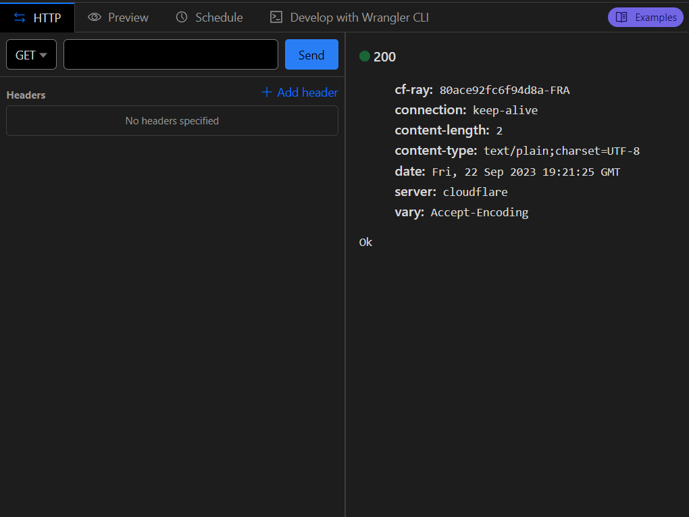

# v2-xBot

v2-xBot is serverless (cloudflare worker) bot to sale & VPN Accounting system.
#

# Features
- [x] Add new order
- [x] Order history
- [x] Management
  - Manage (CRUD) Panels in bot
  - Manage (CRUD) Servers
  - Manage (CRUD) Payment methods
- [ ] Apps & link (for users)
- [ ] User Profile
- [ ] Affiliate system
- [ ] Ticketing system
#

# Get Started
0) Create a cloudflare worker, Create a KV namespace & bind to `db` variable
1) Download [Latest Version](https://github.com/javadib/v2-xbot/releases/latest/download/dist.zip)
2) Extract `dist.zip` and open `index.js` with suitable editor.
3) Edit `bot section` with your variables (line 17-28):
   - Replace `YOUR_BOT_NAME` with your bot name (Optional).
   - Replace `11111111` with your Telegram Admin ID.
   - Replace `@YOUR_SUPPORT_USERNAME` with your support Telegram username (Remember put `@` at the first).
   - Replace `YOUR_BOT_TOKEN` with your Telegram bot token.
4) Update `Plan` models (line 43-87) that are JSON Array, and you can add/remove items. 
5) Update `Server` models (line 115-126) that are JSON Array, and you can add/remove items.
6) Update `Payment` model (line 227-234). Replace your card info for payment. 
7) At the end, whole codes with default cloudflare worker code.
8) Save and deploy worker and send a `GET ` request to `/registerWebhook` path to register webhook of your bot. make sure you see `ok` in response.
#

9) Done!
#

# Custom Edition
Under Development ...
#

#

**Buy Me a Coffee :**
- USDT (TRC20): `TBHBELagtDq9c5cmz4HVjcRcKNiXkxr8Ub`
